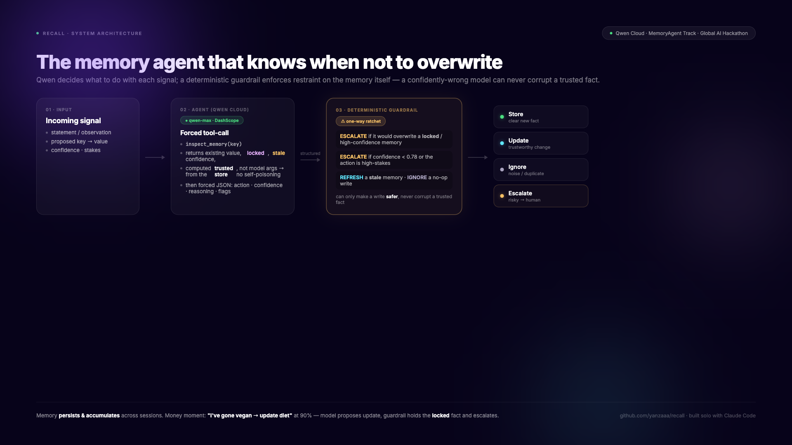

# Recall: the memory agent that knows when *not* to overwrite

> **Global AI Hackathon Series with Qwen Cloud · Track: MemoryAgent · built solo with Claude Code.**

**Live demo:** https://recall-kappa-three.vercel.app · **Repo:** https://github.com/yanzaaa/recall

A memory agent's job is to remember. The trap is that the dangerous failure isn't *forgetting* — it's **silently remembering something wrong.** A single corrupted fact ("user is no longer vegetarian," "budget cap is now $1,000") poisons every future decision the agent makes.

**Recall is an autonomous memory agent built on Qwen that remembers what's clear, ignores the noise, and refuses to corrupt a trusted memory** — escalating to a human instead of overwriting it.



## What it does

Recall holds a long-lived memory of facts and preferences about the user. For each incoming signal it decides one action:

- **store** a genuinely new, confidently-stated fact,
- **update** an existing memory when the new evidence is trustworthy enough,
- **ignore** noise (duplicates, restatements, vague remarks),
- **escalate** to a human when the signal conflicts with a locked/high-confidence memory, is itself low-confidence, or requests a high-stakes / irreversible action.

A person only ever sees the escalation queue. Everything else is remembered, revised, or ignored automatically — without corrupting a trusted memory.

## The differentiator: restraint enforced in code, not in a prompt

Qwen (`qwen-max`) is the reasoning engine, but trust comes from a **deterministic restraint guardrail** (`lib/policy.ts` + `applyMemoryRestraint` in `lib/agent.ts`) that runs on top of the model. Even when the model confidently returns `store`/`update`, the guardrail forces an **escalate** when:

- the signal's **confidence < 0.7**, or
- it would **overwrite a locked** memory (or one at/above **0.8** confidence) with a conflicting value, or
- the action is **high-stakes / irreversible**.

It is a **one-way ratchet**: it can only ever make a memory action *safer* (→ escalate, or downgrade a no-op write to `ignore`), never silently corrupt a trusted fact. So a confidently-wrong model can never poison the memory.

**The money moment:** the user says *"I've gone fully vegan, update my diet"* at 90% confidence. Qwen believes them and moves to **update** the locked `diet=vegetarian` memory. The guardrail **holds it back** and escalates — you don't overwrite a user-confirmed fact on a single statement; you confirm first. The UI shows it: *"the model proposed update, so Recall held back and escalated instead of touching memory."*

## How it's built

- **Qwen (`qwen-max`) on Qwen Cloud**, called through the OpenAI-compatible Alibaba Cloud DashScope endpoint with structured JSON and `temperature: 0`. Proof: [`lib/qwen.ts`](lib/qwen.ts) + the live call in [`lib/agent.ts`](lib/agent.ts).
- **Tool-calling:** before deciding, the agent makes a real Qwen **function call**, `inspect_memory`, to fetch the deterministic state of the existing memory (value, confidence, locked) instead of guessing it. The args are computed from the trusted store, so the model can't poison its own risk signal.
- **The restraint guardrail** (`lib/policy.ts`) is the deterministic safety net that guarantees escalation on risky writes.
- **Next.js (App Router) + TypeScript + Tailwind**, deployed on Vercel.
- **Durable, server-side memory (Supabase / Postgres):** the store lives on the server, not the browser, so `store`/`update` decisions persist and **accumulate across sessions and devices** — a judge on a fresh machine sees the same memory. Degrades to an in-memory seed if the DB is unconfigured. See [`lib/store.ts`](lib/store.ts).
- **Context-budgeted recall:** before each decision the agent ranks memories by relevance and loads only the **top-K within a budget** into the model's context (the rest stay out). See [`lib/recall.ts`](lib/recall.ts).
- **Timely forgetting (decay):** a memory with a `ttlDays` goes *stale* once past its TTL and **loses its overwrite protection**, so outdated facts get refreshed instead of guarded — while locked/fresh facts stay protected. So Recall knows when to write, when to **forget**, when to **recall under budget**, and when to refuse.
- **A key-free deterministic fallback** keeps the app running if the API is unavailable, so the demo never crashes.

## Tests

The safety property is unit-tested: **26 Vitest tests** (`npm test`) pin the guardrail invariants — low-confidence, high-stakes, and locked/high-confidence overwrites all force escalation; a clean new fact stores; a restatement is downgraded to `ignore`; a **stale** memory loses its protection and is refreshed; budgeted recall loads only the top-K within its budget; and an `escalate` is never downgraded to a write (the one-way ratchet). See [`tests/restraint.test.ts`](tests/restraint.test.ts).

> Note: writes are last-write-wins per key (best-effort under concurrency) — fine for the demo; a production deployment would use a transactional upsert.

## Run it locally

```bash
npm install
cp .env.example .env     # add your Qwen Cloud (DASHSCOPE) API key
npm run dev              # http://localhost:3000
```

Click **Run Recall on the signals**. With a valid key it uses live Qwen; without one it runs the deterministic fallback so you can still see the full flow.

## What's next

- Learn the lock / confidence / TTL thresholds from human confirmations and overrides over time.
- Embeddings-based relevance for the recall ranker, and per-user memory namespaces.
- A "memory diff" view so a human approves an escalated overwrite in one click.
- Cross-agent memory: let other agents read Recall's vetted memory but never write it unguarded.

Built solo with **Claude Code**.
